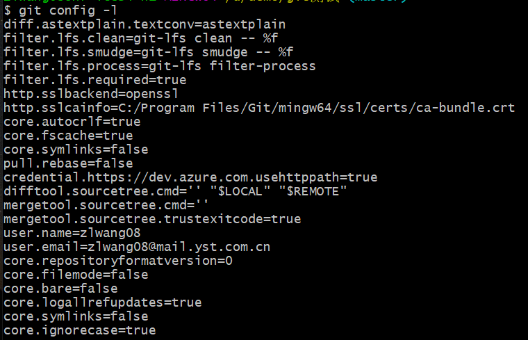
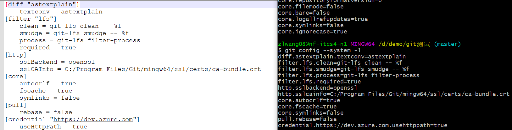
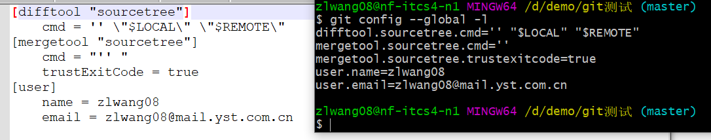
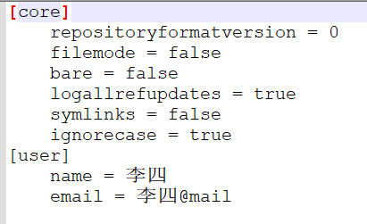
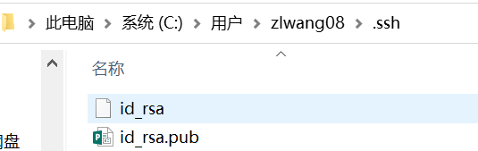

git

一、git工作区

git的工作区有三个或者四个。

三个工作区：工作目录、暂存区、本地资源库

四个工作区：工作目录、暂存区、本地资源库、远程资源库

> 工作目录：一般就是我们本地的文件，直接对其文件或内容进行修改
>
> 暂存区：
>
> 本地资源库：
>
> 远程资源库：github、gitlab、gitee等这些都属于远程资源库

所以文件就会有上述资源的转变，工作目录-->暂存区、暂存区-->本地资源库、本地资源库-->远程仓库、远程仓库-->本地资源库、本地资源库-->暂存区、暂存区-->工作目录。所以，git的部分命令也就由此展开。

二、git安装

https://git-scm.com/	下载，然后安装->无脑下一步

三、git配置

git安装完成后，首先查看git的配置。

> git config -l 或 git config --list
>
> git config --system -l 或 git config --system --list ，查看git系统配置
>
> git config --global -l 或 git config --global --list，查看git全局配置

例图：

其实git的配置就是一个文件内容。

git config --system -l ,git的system级别的日志在 C:\Program Files\Git\etc\gitconfig中

git config --global -l ,git的global级别的日志在 C:\Users\Administrator\.gitconfig中

四、git添加用户名和邮箱

添加用户名和邮箱分为全局和项目级别。添加方式可以使用命令行方式，也可以直接修改文件。

1、全局添加

> 命令行方式

git config --global user.name "张三"

git config --global user.email "张三@mail"

> 修改文件方式

打开C:\Users\Administrator\\路径下的.gitconfig文件，添加即可

2、项目级别

> 命令行方式，需要先init一个git仓库。cmd，进入到该项目中。

git config user.name "李四"

git config user.email "李四@mail"

我们可以打开该仓库中隐藏文件夹.git/config文件

> 修改文件方式

也可以直接打开仓库中的隐藏文件夹.git/config文件，添加name和email即可。

五、ssh key

我们为git设置好了name和email，其实已经可以使用了。但是为什么还需要生成秘钥呢？

如果不设置秘钥，那么在我们每次操作文件(提交、拉取等)时，经常需要我们输入用户名和密码。为了方便操作，需要生成一个免密操作的秘钥。

> ssh-keygen

使用上面的命令，就会生成两个秘钥文件，一个私钥，一个公钥。

id_rsa：是私钥，id_rsa.pub：公钥

将公钥信息添加到远程仓库即可进行免密操作。

