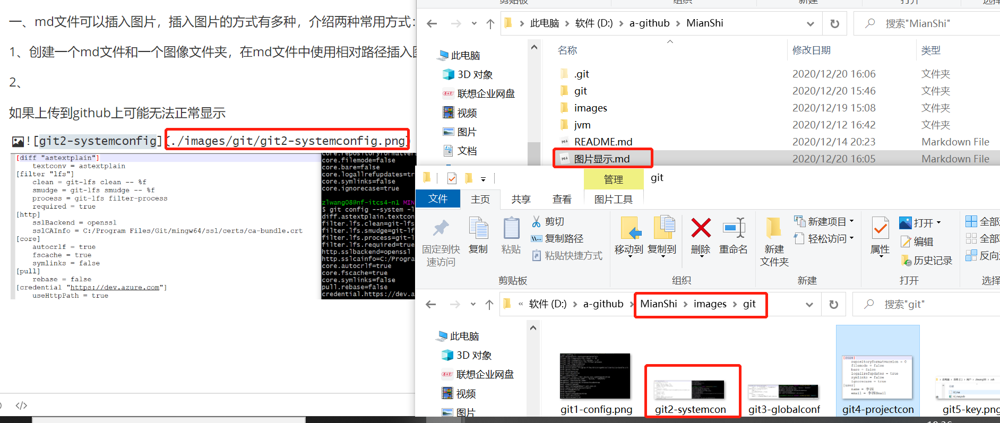
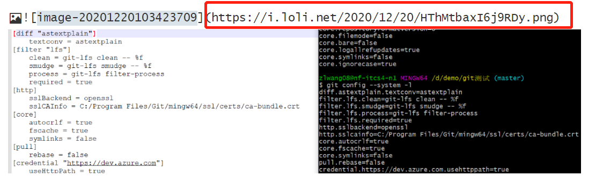

### github图片显示问题 ###

---

一、md文件可以插入图片，插入图片的方式有多种，介绍两种常用方式：

1、创建一个md文件和一个图像文件夹，在md文件中使用相对路径插入图片




当然，我们本地的图片也需要上传到github上，文件路径也必须一致。


2、使用图床，将图片上传到图床，返回我们该图片的url，插入到md文件中。



一般使用Typora+picgo+图床的策略，我们只需正常的截图(后台自动进行图片上传，返回给我们url)，让后粘贴在Typora上，即可。

图床，免费的图床很多，我使用的是sm.ms图床，5G容量。

Typora+picgo+图床搭建可以参考：https://blog.csdn.net/qq__590980/article/details/104547933

二、通过上面方式，发现本地图片在md文件中可以正常，一旦上传到github上，图片就无法显示。

不仅仅是自己文章中的图片，查阅其他文章，发现图片也无法显示。

解决办法：

1、C:\Windows\System32\drivers\etc下的hosts文件

2、将如下内如追加到hosts文件末尾

```
192.30.253.112 Build software better, together
192.30.253.119 gist.github.com
151.101.184.133 assets-cdn.github.com
151.101.184.133 raw.githubusercontent.com
151.101.184.133 gist.githubusercontent.com
151.101.184.133 cloud.githubusercontent.com
151.101.184.133 camo.githubusercontent.com
151.101.184.133 avatars0.githubusercontent.com
151.101.184.133 avatars1.githubusercontent.com
151.101.184.133 avatars2.githubusercontent.com
151.101.184.133 avatars3.githubusercontent.com
151.101.184.133 avatars4.githubusercontent.com
151.101.184.133 avatars5.githubusercontent.com
151.101.184.133 avatars6.githubusercontent.com
151.101.184.133 avatars7.githubusercontent.com
151.101.184.133 avatars8.githubusercontent.com
```

